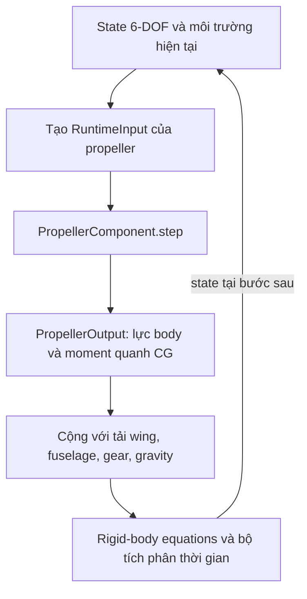
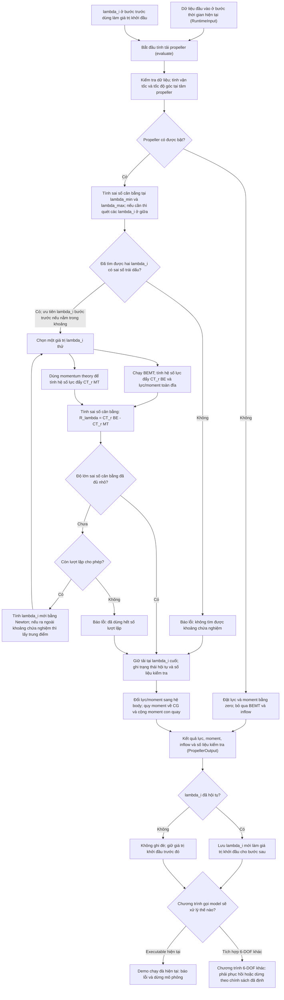
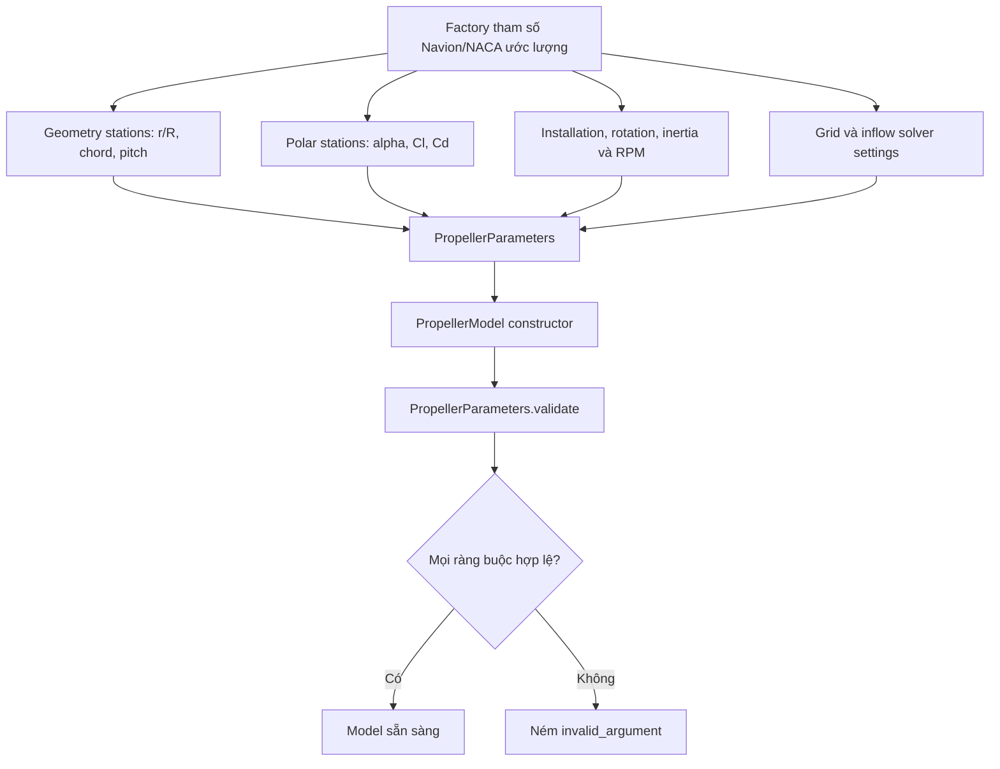
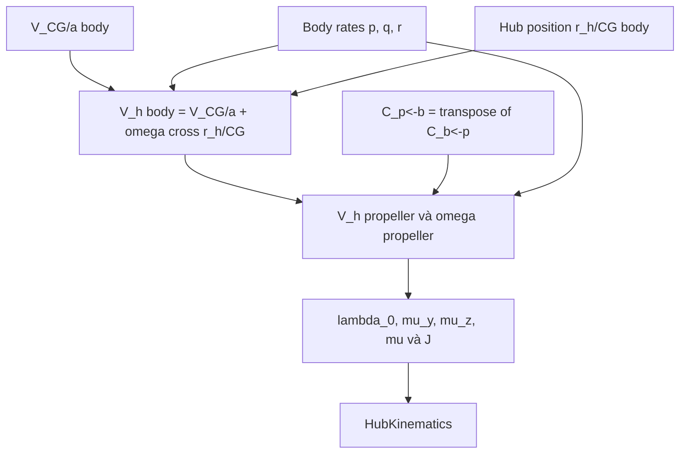
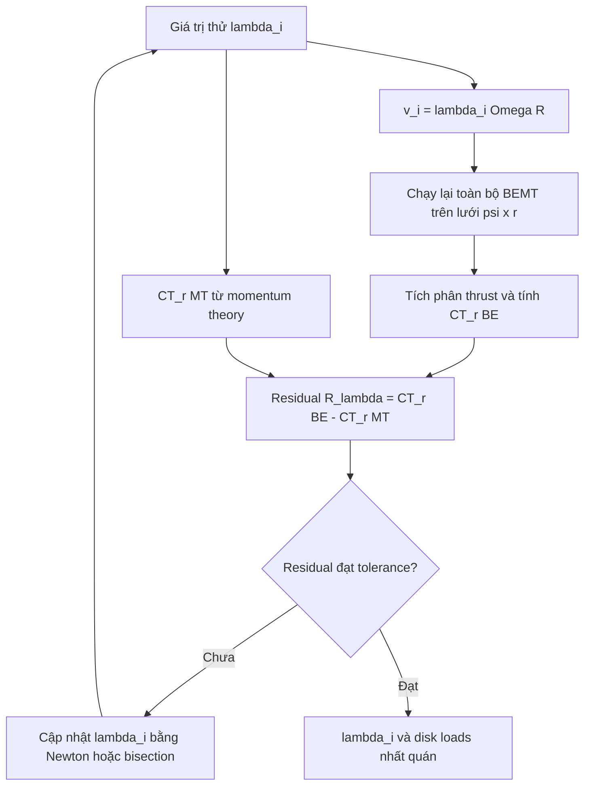
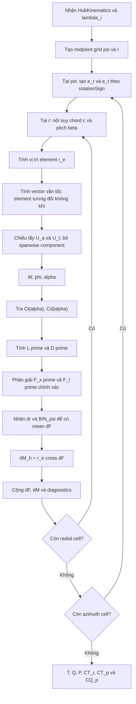
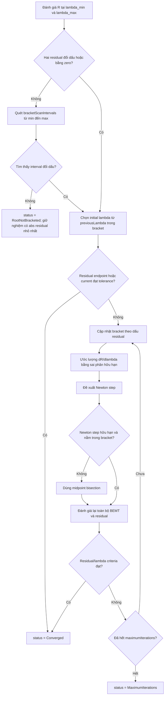
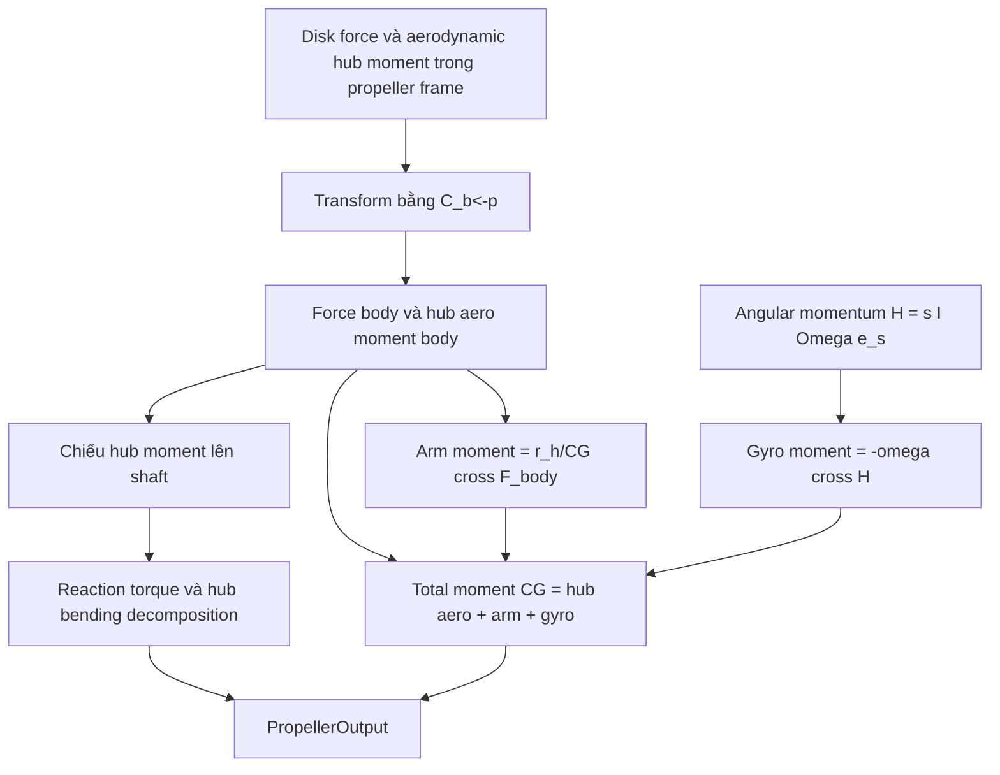
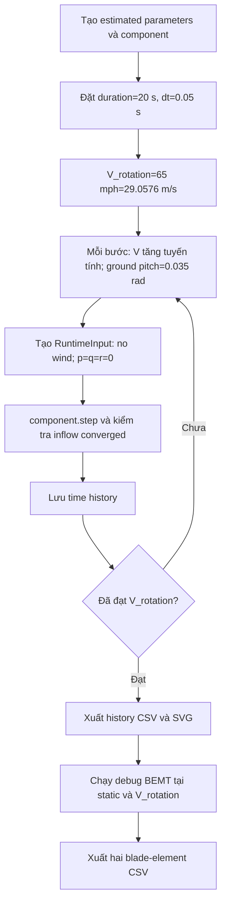
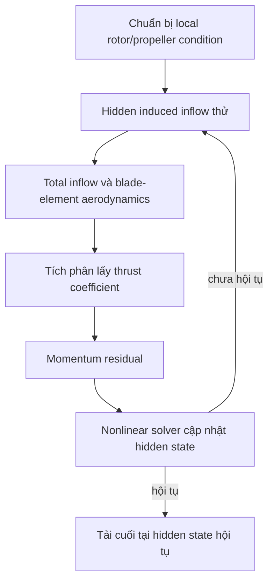

# Navion Propeller V1 — sơ đồ luồng tính toán C++

## 1. Mục đích và phạm vi

Tài liệu này mô tả **đúng implementation hiện tại**, không phải thiết kế dự kiến
cho phiên bản sau. Các hàm chính được mô tả là:

- `makeEstimatedNavionNaca5868_9Parameters()`;
- `PropellerParameters::validate()`;
- `PropellerComponent::step()`;
- `PropellerModel::evaluate()`;
- `PropellerModel::calculateHubKinematics()`;
- `PropellerModel::evaluateResidual()`;
- `PropellerModel::evaluateDiskWithKinematics()`;
- `AirfoilPolar::lookup()`.

V1 là mô hình blade-element phi tuyến ghép với **uniform momentum inflow
quasi-steady**. Một scalar `lambdaInduced` được giải đại số trong mỗi lần gọi.
RPM và blade pitch hiện bị khóa bởi cấu hình; không có engine hoặc governor.

Toàn bộ runtime API dùng SI và radian. Quy ước:

- body: `+x_b` về trước, `+y_b` sang phải, `+z_b` xuống dưới;
- propeller: `+x_p` dọc shaft theo chiều thrust dương;
- disk nằm trong mặt phẳng `y_p-z_p`;
- `C_b<-p = bodyFromPropeller` đổi thành phần vector từ propeller sang body;
- `rotationSign = +1` là chiều dương theo quy tắc bàn tay phải quanh `+x_p`;
- `psi = 0` đặt blade theo `+y_p`.

> **Cảnh báo dữ liệu:** mọi giá trị hình học NACA 5868-9-like, Clark-Y polar,
> installation, inertia, RPM và pitch trong factory hiện tại đều là ước lượng
> phục vụ phát triển phần mềm. Chúng chưa phải dữ liệu Navion/NACA đã kiểm chứng.

---

## 2. Cấp 0 — vị trí của component trong mô phỏng 6-DOF

`PropellerModel` không tích phân trạng thái máy bay. Nó chỉ ánh xạ điều kiện
hiện tại sang tải:

\[
(\mathbf V_{CG/a}^b,\boldsymbol\omega^b,\rho,a)
\longmapsto
(\mathbf F_{prop}^b,\mathbf M_{prop,CG}^b).
\]

`lambdaInduced` là hidden variable đại số của phép ánh xạ này. Giá trị ở bước
trước chỉ được dùng làm initial guess, không phải trạng thái dynamic inflow.

---

## 3. Cấp 1 — luồng tổng của một lần `step()`

### 3.1 Giải nghĩa các khối chính trong sơ đồ

| Tên khối dễ đọc | Phép tính thực sự và mục đích |
|---|---|
| Kiểm tra dữ liệu; tính vận tốc và tốc độ góc tại tâm propeller | Kiểm tra vector, mật độ và vận tốc âm thanh là hữu hạn/hợp lệ. Sau đó tính `V_h^b = V_CG/a^b + omega^b cross r_h/CG^b` rồi đổi `V_h` và `omega` sang hệ propeller. Đây là điều kiện dòng tới mà mọi blade element sẽ sử dụng. |
| Tính sai số cân bằng tại `lambda_min`, `lambda_max` và quét các giá trị ở giữa | Xác định một khoảng `[lambda_L,lambda_U]` sao cho `R(lambda_L)` và `R(lambda_U)` trái dấu. Mỗi lần tính sai số ở đây đều chạy toàn bộ BEMT. |
| Đã tìm được hai `lambda_i` có sai số trái dấu? | Đây chính là câu hỏi “đã tìm được khoảng chứa nghiệm chưa?”. Nếu `R_L R_U <= 0`, khoảng đó chứa ít nhất một nghiệm khi residual liên tục. Nếu không tìm được, solver không cho Newton chạy tự do ngoài miền cấu hình. |
| Chạy BEMT với `lambda_i` thử; tính `CT_r_BE` và lực/moment toàn đĩa | Dùng `v_i=lambda_i Omega R`, tính vận tốc, `phi`, `alpha`, `Cl`, `Cd`, `dF`, `dM` tại mọi ô `psi x r`, rồi tích phân. `CT_r_BE` và disk loads là **đầu ra được tính ra** bởi khối này. |
| Dùng momentum theory để tính `CT_r_MT` | Tính `CT_r_MT = 2 lambda_i sqrt(mu^2+(lambda_0+lambda_i)^2)` với cùng `lambda_i` thử để có đại lượng so sánh với BEMT. |
| Tính sai số cân bằng `R_lambda` | Lấy `CT_r_BE-CT_r_MT`. Residual là tên trong code của sai số này; nghiệm inflow được chấp nhận khi độ lớn sai số đủ nhỏ. |
| Tính `lambda_i` mới bằng Newton; nếu ra ngoài khoảng thì lấy trung điểm | Trước hết dùng `lambda_new=lambda-R/R'`. Nếu đạo hàm không dùng được hoặc `lambda_new` ra ngoài `[lambda_L,lambda_U]`, thay bằng `(lambda_L+lambda_U)/2`. Đây là Newton có giới hạn an toàn bằng phương pháp chia đôi. |
| Ghi trạng thái hội tụ và số liệu kiểm tra | Lưu `converged/status`, số lượt lặp, số lần tính residual, `lambda_i`, induced velocity, residual cuối, `CT_r_MT`, miền alpha, Mach lớn nhất và các cờ cảnh báo. Các số liệu này dùng để kiểm tra chất lượng phép tính; chúng không phải lực hoặc moment bổ sung. |

Trong tài liệu này, thuật ngữ tiếng Anh `diagnostics` trong tên field C++ có
nghĩa là **số liệu kiểm tra/chẩn đoán phép tính**. Nó giúp trả lời các câu hỏi
như solver có hội tụ không, residual còn bao nhiêu, có vượt miền polar không;
nó không tham gia cộng vào tải 6-DOF.

Hộp `Chạy BEMT với lambda_i thử` được chạy lại cho **mỗi** giá trị thử
`lambda_i`, kể cả các điểm dùng để tính đạo hàm sai phân hữu hạn. Solver chỉ ra
khỏi vòng lặp khi residual hội tụ, không bracket được nghiệm, hoặc đã dùng hết
`maximumIterations`.

Nếu solve thất bại, việc `PropellerComponent` giữ `lastLambdaInduced` cũ không
có nghĩa là solver bỏ qua Newton hay chấp nhận nghiệm cũ làm nghiệm hiện tại.
Newton/bisection đã được thử bên trong `evaluate()` trước khi trả failure status.
Giá trị cũ được giữ lại vì nó là nghiệm gần nhất đã từng hội tụ, hoặc là initial
guess cấu hình nếu chưa có lần hội tụ nào. Ghi đè bằng một candidate thất bại có
thể làm hỏng warm start của lần thử phục hồi sau.

Một lần gọi lại với đúng input và đúng solver settings thường chỉ lặp lại cùng
thất bại. Retry chỉ có ý nghĩa nếu caller thay đổi chiến lược, chẳng hạn mở rộng
bounds, tăng iteration limit, giảm bước thời gian/đưa điều kiện về gần nghiệm
trước, hoặc sửa dữ liệu gây residual không có nghiệm. Caller không được mặc
nhiên đưa tải non-converged vào rigid-body equations.

Riêng `app/takeoff_roll.cpp` kiểm tra `output.inflow.converged` ngay sau
`component.step()` và ném `runtime_error` nếu false. Vì vậy demo hiện tại dừng
ngay; nó không đi tiếp sang time step sau với warm start cũ.

Trong code hiện tại, disk evaluation của lần đánh giá residual cuối được lưu
trong `ResidualEvaluation::disk`; vì vậy tải cuối được tái sử dụng, không chạy
BEMT thừa thêm một lần sau hội tụ. Khi status không hội tụ, output vẫn chứa
candidate cuối/tốt nhất để chẩn đoán, nhưng candidate đó không phải tải hợp lệ
cho 6-DOF nếu caller chưa áp dụng một failure policy có chủ đích.

---

## 4. Cấp 2 — chuẩn bị và kiểm tra dữ liệu tĩnh

Các kiểm tra gồm polar tăng nghiêm ngặt theo `alpha`, geometry tăng nghiêm ngặt
theo `r/R`, coverage từ root cutout đến tip, các đại lượng dương/hữu hạn, grid
tối thiểu, solver bounds hợp lệ, và `bodyFromPropeller` là ma trận quay trực
chuẩn có determinant `+1`.

### 4.1 Toàn bộ tham số tĩnh của `PropellerParameters`

| Trường C++ | Đơn vị | Đi vào phép tính nào | Tác dụng vật lý hoặc số học |
|---|---:|---|---|
| `propellerName` | — | metadata/output | Tên cấu hình; không ảnh hưởng nghiệm. |
| `airfoilName` | — | metadata/output | Tên polar; không ảnh hưởng nghiệm. |
| `bladeCount = B` | — | disk quadrature | Nhân tải mean của một blade bằng `B`; tăng trực tiếp lực và moment blade-element trước khi inflow tái cân bằng. |
| `radius_m = R` | m | geometry, tip speed, area, normalization | Đặt bán kính tip, `r_0`, `dr`, `D=2R`, `A=pi R^2`, `Omega R` và các coefficient. |
| `rootCutoutFraction` | — | radial grid | Đặt `r_0/R`; miền dưới root cutout không sinh tải. |
| `rotationRate_rad_s = Omega` | rad/s | mọi vận tốc quay, normalization, power, gyro | Tạo `Omega r`, tip speed, `n`, RPM diagnostic, `P=Q Omega`, và angular momentum. V1 giữ cố định. |
| `rotationSign = s_Omega` | `-1/+1` | `e_t`, torque sign, gyro | Chọn chiều quay vật lý; đổi dấu moment reaction, P-factor liên quan chiều quay và angular momentum. |
| `rotatingInertia_kg_m2 = I_spin` | kg m² | gyroscopic moment | Tạo `H=s_Omega I_spin Omega e_s`; không ảnh hưởng BEMT/inflow khi RPM cố định. |
| `hubPositionFromCg_body_m` | m | hub velocity, arm moment | Dùng trong `omega cross r_h/CG` và `r_h/CG cross F`; vì vậy ảnh hưởng cả local inflow lẫn moment quanh CG. |
| `bodyFromPropeller` | — | đổi hệ trục | Xác định installation/shaft direction; transpose được dùng làm `C_p<-b`. |
| `bladeGeometry` | — | geometry interpolation | Bảng `r/R -> c(r), beta(r)` được nội suy tuyến tính tại tâm radial cell. |
| `airfoilPolar` | — | section aerodynamics | Bảng `alpha -> Cl,Cd`; nội suy tuyến tính, clamp tại hai biên và tăng diagnostic counter. |
| `radialElementCount = N_r` | — | radial quadrature | Số midpoint cells từ `r_0` đến `R`; điều khiển độ phân giải và chi phí. |
| `azimuthStationCount = N_psi` | — | azimuth quadrature | Số midpoint azimuth; cần để giữ bất đối xứng tải, mean P-factor và rate damping. |
| `compressibilityWarningMach` | — | diagnostic | Chỉ bật cảnh báo khi `max(W/a)` vượt ngưỡng; **không** hiệu chỉnh `Cl`, `Cd` hoặc tải. |
| `inflow` | — | inflow solver | Gom toàn bộ bounds, tolerance, step và iteration limit được trình bày ở dưới. |

Các đại lượng dẫn xuất không được nạp độc lập:

\[
D=2R,\quad A=\pi R^2,\quad V_{tip}=\Omega R,\quad
n=\frac{\Omega}{2\pi},\quad RPM=60n.
\]

### 4.2 Mỗi `BladeStation`

| Trường | Đơn vị | Tác dụng |
|---|---:|---|
| `radiusFraction` | — | Tọa độ độc lập `r/R` để nội suy geometry. |
| `chord_m` | m | Nhân trực tiếp diện tích section trong `L'` và `D'`. |
| `pitch_rad` | rad | Góc chord so với disk plane; tạo `alpha=beta-phi`. |

Factory hiện tại tạo twist theo constant-geometric-pitch helix:

\[
\beta(x)=\tan^{-1}\left(
\frac{x_{ref}\tan\beta_{ref}}{x}
\right),\qquad x=\frac rR,
\]

với `x_ref=30/42` và `beta_ref=0.27 rad`. Đây là placeholder; không phải
`theta_75` và không phải governor schedule.

### 4.3 Mỗi `PolarPoint`

| Trường | Đơn vị | Tác dụng |
|---|---:|---|
| `alpha_rad` | rad | Trục tra bảng, phải tăng nghiêm ngặt. |
| `cl` | — | Tạo lift per unit span. |
| `cd` | — | Tạo drag per unit span và phải không âm. |

Nếu `alpha` nằm ngoài miền bảng, code dùng coefficient ở endpoint gần nhất và
đặt `polarClamped=true`; code không extrapolate.

### 4.4 Toàn bộ `InflowSolverSettings`

| Trường C++ | Tác dụng trong thuật toán |
|---|---|
| `lambdaMinimum` | Cận dưới miền tìm nghiệm. V1 yêu cầu không âm, nên chỉ mô hình powered positive induced inflow. |
| `lambdaMaximum` | Cận trên miền tìm nghiệm và giới hạn bước đạo hàm. |
| `initialGuess` | Warm start khi mới tạo `PropellerComponent`; không ép nghiệm vật lý. |
| `residualTolerance` | Điều kiện chính `abs(R_lambda)` để tuyên bố hội tụ. |
| `lambdaTolerance` | Điều kiện phụ cho thay đổi nghiệm rất nhỏ; vẫn yêu cầu residual không lớn hơn `10 residualTolerance`. |
| `derivativeStep` | Hệ số tạo bước sai phân hữu hạn trung tâm/gần trung tâm: `h=step max(1,abs(lambda))`. |
| `maximumIterations` | Số vòng Newton/bisection tối đa sau khi đã bracket nghiệm. |
| `bracketScanIntervals` | Số đoạn quét trong bounds nếu hai endpoint ban đầu không đổi dấu. |

---

## 5. Cấp 2 — chuẩn bị runtime data và hub kinematics

### 5.1 Toàn bộ runtime input

| Trường C++ | Đơn vị | Tác dụng |
|---|---:|---|
| `velocityCgRelativeAir_body_m_s` | m/s | Vận tốc aircraft CG tương đối với không khí trong body axes. Environment phải đưa wind/gust vào nhất quán trước khi gọi. |
| `angularRateBodyWrtInertial_body_rad_s` | rad/s | Tạo vận tốc hub và element do chuyển động quay body; đồng thời tạo aerodynamic rate damping và gyro moment. |
| `airDensity_kg_m3` | kg/m³ | Nhân dynamic pressure và các tải; phải dương. Vì polar không phụ thuộc Re, nghiệm `lambda_i` lý tưởng không phụ thuộc `rho`. |
| `speedOfSound_m_s` | m/s | Chỉ dùng tính `sectionMach=W/a` và warning; không có compressibility correction trong V1. |
| `enabled` | bool | `false` làm tải và diagnostics khí động bằng zero, bỏ qua inflow/BEMT. |

Hai đối số runtime ngoài struct:

| Đối số | Tác dụng |
|---|---|
| `previousLambdaInduced` | Initial guess của lần solve hiện tại, được clamp vào bracket. Không thay đổi phương trình residual. |
| `captureElementSamples` | Chỉ điều khiển việc lưu `N_r N_psi` mẫu debug; không thay đổi tải. Solver luôn đặt `false` để giảm bộ nhớ. |

### 5.2 Hub kinematics và các tỷ số

\[
\mathbf V_h^b=\mathbf V_{CG/a}^b+
\boldsymbol\omega^b\times\mathbf r_{h/CG}^b,
\]

\[
\mathbf V_h^p=C_{p\leftarrow b}\mathbf V_h^b,qquad
\boldsymbol\omega^p=C_{p\leftarrow b}\boldsymbol\omega^b.
\]

\[
\lambda_0=\frac{V_{h,x}^p}{\Omega R},\qquad
\mu_y=\frac{V_{h,y}^p}{\Omega R},\qquad
\mu_z=\frac{V_{h,z}^p}{\Omega R},
\]

\[
\mu=\sqrt{\mu_y^2+\mu_z^2},\qquad
J=\frac{V_{h,x}^p}{nD}.
\]

`J` chỉ là diagnostic. Momentum residual dùng `lambda_0`, `mu` và
`lambda_i`; BEMT dùng trực tiếp toàn vector `V_h^p`, nên vẫn giữ hướng của
cross-flow để tính bất đối xứng azimuth.

---

## 6. Cấp 3 — vòng kín BEMT và uniform inflow

Đây là quan hệ cấu trúc quan trọng nhất:

BEMT cần `lambda_i` để biết local inflow và angle of attack; momentum theory
cần thrust từ BEMT để biết `lambda_i`. Do đó hai khối không chạy độc lập:

\[
T_{BE}(\lambda_i)=T_{MT}(\lambda_i).
\]

Trong V1 chỉ axial thrust coefficient tham gia scalar closure. Torque, force
ngang, P-factor moment và gyro moment không tạo thêm residual.

---

## 7. Cấp 4 — thuật toán BEMT đúng như code C++

### 7.1 Grid và basis tại element

Midpoint quadrature:

\[
\psi_j=2\pi\frac{j+1/2}{N_\psi},\qquad
r_k=r_0+(k+1/2)\Delta r,
\]

\[
r_0=R\,x_{cutout},\qquad
\Delta r=\frac{R-r_0}{N_r}.
\]

\[
\mathbf e_r^p=(0,\cos\psi,\sin\psi),\qquad
\mathbf e_t^p=s_\Omega(\mathbf e_x^p\times\mathbf e_r^p),
\]

\[
\mathbf r_e^p=r\mathbf e_r^p.
\]

### 7.2 Local velocity

\[
v_i=\lambda_i\Omega R,
\]

\[
\mathbf U_e^p=
\mathbf V_h^p+
\boldsymbol\omega^p\times\mathbf r_e^p+
\Omega r\mathbf e_t^p+
v_i\mathbf e_x^p.
\]

Các hạng có ý nghĩa lần lượt là hub translation, body rotation tại element,
blade rotation và uniform induced velocity. V1 bỏ radial velocity trong polar:

\[
U_a=\mathbf U_e^p\cdot\mathbf e_x^p,\qquad
U_t=\mathbf U_e^p\cdot\mathbf e_t^p.
\]

`U_t <= 0` chỉ tăng `reverseTangentialFlowCount`; V1 vẫn tiếp tục tính bằng
công thức 2-D và vì vậy kết quả reverse flow không được coi là tin cậy.

### 7.3 Section aerodynamics

\[
W^2=U_a^2+U_t^2,\qquad
\phi=\operatorname{atan2}(U_a,U_t),\qquad
\alpha=\beta(r)-\phi.
\]

\[
L'=\frac12\rho W^2c(r)C_l(\alpha),\qquad
D'=\frac12\rho W^2c(r)C_d(\alpha).
\]

Phân giải lực chính xác, không dùng xấp xỉ góc inflow nhỏ:

\[
F_x'=L'\cos\phi-D'\sin\phi,
\]

\[
F_t'=-L'\sin\phi-D'\cos\phi.
\]

\[
\mathbf F'=F_x'\mathbf e_x^p+F_t'\mathbf e_t^p.
\]

### 7.4 Disk-mean integration

Vì code lấy midpoint average theo azimuth, weight của mỗi cell là:

\[
w_{cell}=\Delta r\frac{B}{N_\psi}.
\]

\[
\Delta\overline{\mathbf F}_{jk}^p=\mathbf F'_{jk}w_{cell},\qquad
\Delta\overline{\mathbf M}_{h,jk}^p=
\mathbf r_{e,jk}^p\times\Delta\overline{\mathbf F}_{jk}^p.
\]

\[
\mathbf F_h^p=\sum_{j,k}\Delta\overline{\mathbf F}_{jk}^p,
\qquad
\mathbf M_{h,aero}^p=
\sum_{j,k}\Delta\overline{\mathbf M}_{h,jk}^p.
\]

Như vậy `aerodynamicMomentAtHub` đã chứa shaft reaction torque và hub bending
moments. Không được cộng một reaction torque độc lập lần thứ hai.

### 7.5 Các tải và coefficient được tạo sau tích phân

\[
T=F_{h,x}^p,qquad
Q_{required}=-s_\Omega M_{h,x}^p,qquad
P_{required}=Q_{required}\Omega.
\]

Momentum residual dùng rotor normalization:

\[
C_{T,r}^{BE}=\frac{T}{\rho A(\Omega R)^2}.
\]

Propeller normalization chỉ dùng diagnostic/validation:

\[
C_{T,p}=\frac{T}{\rho n^2D^4},\qquad
C_{Q,p}=\frac{Q}{\rho n^2D^5}.
\]

Không được trộn `thrustCoefficientRotor` với `thrustCoefficientPropeller` vì
chúng có reference khác nhau.

---

## 8. Cấp 4 — thuật toán inflow solver đúng như code C++

### 8.1 Momentum residual

Với mỗi `lambda_i` thử, `evaluateResidual()` gọi toàn bộ BEMT rồi tính:

\[
C_{T,r}^{MT}=2\lambda_i
\sqrt{\mu^2+(\lambda_0+\lambda_i)^2},
\]

\[
R_\lambda(\lambda_i)=C_{T,r}^{BE}(\lambda_i)-C_{T,r}^{MT}(\lambda_i).
\]

Ở static axial condition:

\[
\lambda_0=0,\quad\mu=0
\quad\Rightarrow\quad
C_{T,r}=2\lambda_i^2.
\]

### 8.2 Bracket scan + safeguarded Newton/bisection

Đạo hàm số được tính bởi:

\[
h=\texttt{derivativeStep}\max(1,|\lambda_i|),
\]

\[
R'_\lambda\approx
\frac{R(\lambda_{high})-R(\lambda_{low})}
{\lambda_{high}-\lambda_{low}},
\]

trong đó hai điểm đạo hàm bị giới hạn trong `[lambdaMinimum,
lambdaMaximum]`. Newton proposal là:

\[
\lambda_{new}=\lambda_i-\frac{R_\lambda}{R'_\lambda}.
\]

Nếu đạo hàm không hữu hạn/quá nhỏ hoặc proposal ra ngoài bracket, code thay nó
bằng midpoint bisection. Solver trả rõ một trong ba trạng thái:

- `Converged`;
- `RootNotBracketed`;
- `MaximumIterations`.

`PropellerComponent` chỉ cập nhật `lastLambdaInduced` khi trạng thái là
`Converged`. Đây là failure containment về warm start; application/6-DOF layer
vẫn phải quyết định chính sách xử lý output không hội tụ.

---

## 9. Cấp 3 — đổi tải disk sang tải body quanh CG

\[
\mathbf F_{prop}^b=C_{b\leftarrow p}\mathbf F_h^p,
\]

\[
\mathbf M_{h,aero}^b=C_{b\leftarrow p}\mathbf M_{h,aero}^p.
\]

Với shaft unit vector trong body:

\[
\mathbf e_s^b=C_{b\leftarrow p}(1,0,0),
\]

\[
\mathbf M_{reaction}^b=
(\mathbf M_{h,aero}^b\cdot\mathbf e_s^b)\mathbf e_s^b,
\]

\[
\mathbf M_{bend}^b=\mathbf M_{h,aero}^b-\mathbf M_{reaction}^b.
\]

Hai đại lượng trên chỉ là decomposition của cùng hub moment. Tổng moment không
cộng chúng riêng lẻ:

\[
\mathbf M_{arm}^b=\mathbf r_{h/CG}^b\times\mathbf F_{prop}^b,
\]

\[
\mathbf H_{prop}^b=s_\Omega I_{spin}\Omega\mathbf e_s^b,
\qquad
\mathbf M_{gyro}^b=-\boldsymbol\omega^b\times\mathbf H_{prop}^b,
\]

\[
\boxed{
\mathbf M_{prop,CG}^b=
\mathbf M_{h,aero}^b+
\mathbf M_{arm}^b+
\mathbf M_{gyro}^b}
\]

---

## 10. Toàn bộ output và ý nghĩa trong downstream model

### 10.1 `HubKinematics`

| Trường | Ý nghĩa |
|---|---|
| `velocityRelativeAir_propeller_m_s` | Local hub velocity đã đổi sang propeller axes. |
| `bodyAngularRate_propeller_rad_s` | Body rates trong propeller axes, dùng cho element kinematics. |
| `lambdaFreestream` | Axial freestream ratio `V_hx/(Omega R)`. |
| `muY`, `muZ` | Hai thành phần cross-flow ratio có hướng. |
| `muMagnitude` | Độ lớn cross-flow ratio dùng trong momentum closure. |
| `advanceRatioJ` | Propeller advance ratio dùng diagnostic. |

### 10.2 `DiskLoads`

| Trường | Ý nghĩa |
|---|---|
| `force_propeller_N` | Disk-mean force vector trong propeller axes. |
| `aerodynamicMomentAtHub_propeller_Nm` | Full moment do `sum(r cross dF)` tại hub. |
| `thrust_N` | Thành phần `force_propeller_N.x`. |
| `torqueRequired_Nm` | Shaft torque dương cần từ engine để cân bằng aerodynamic reaction. |
| `shaftPowerRequired_W` | `Q_required Omega`; hiện chỉ diagnostic, không hồi tiếp RPM. |
| `thrustCoefficientRotor` | `CT_r` dùng trong inflow residual. |
| `thrustCoefficientPropeller` | `CT_p` dùng so sánh propeller chart. |
| `torqueCoefficientPropeller` | `CQ_p` dùng so sánh propeller chart. |
| `minimumAlpha_rad`, `maximumAlpha_rad` | Miền angle of attack đã gặp trên disk. |
| `maximumSectionMach` | Giá trị lớn nhất của `W/a`. |
| `compressibilityWarning` | Báo max section Mach vượt ngưỡng cấu hình. |
| `polarClampCount` | Số cell dùng endpoint polar vì alpha ngoài bảng. |
| `reverseTangentialFlowCount` | Số cell có `U_t <= 0`. |
| `elementCount` | Số cell thực sự đóng góp tải. |

### 10.3 `InflowDiagnostics`

| Trường | Ý nghĩa |
|---|---|
| `status`, `converged`, `rootBracketed` | Trạng thái và chất lượng solve. |
| `iterations` | Số iteration trong vòng Newton/bisection. |
| `residualEvaluations` | Số lần chạy residual; mỗi lần tương ứng một full BEMT disk evaluation. |
| `lambdaInduced` | Nghiệm induced inflow ratio cuối. |
| `inducedVelocity_m_s` | `lambdaInduced Omega R`. |
| `momentumResidual` | `CT_r_BE - CT_r_MT` tại nghiệm cuối. |
| `momentumThrustCoefficient` | `CT_r_MT` tại nghiệm cuối. |

### 10.4 `PropellerOutput`

| Trường | Ý nghĩa |
|---|---|
| `force_body_N` | Lực propeller đưa vào tổng lực 6-DOF. |
| `aerodynamicMomentAtHub_body_Nm` | Full aerodynamic hub moment trong body. |
| `reactionTorque_body_Nm` | Phần hub moment song song shaft; diagnostic decomposition. |
| `hubBendingMoment_body_Nm` | Phần hub moment vuông góc shaft, gồm mean P-factor/rate effects. |
| `momentArm_body_Nm` | Moment quanh CG do hub không nằm tại CG. |
| `gyroscopicMoment_body_Nm` | Moment con quay của rotating assembly. |
| `totalMomentAtCg_body_Nm` | Moment duy nhất cần cộng vào tổng moment 6-DOF. |

### 10.5 `ElementSample` khi bật debug capture

Mỗi record lưu `psi`, `r`, `r/R`, `c`, `beta`, `U_a`, `U_t`, `phi`, `alpha`,
`Cl`, `Cd`, mean `dF`, mean `dM` và polar-clamp flag. Tổng tất cả `dF`, `dM`
phải khôi phục đúng `DiskLoads`.

---

## 11. Luồng riêng của executable chạy đà hiện tại

Các tham số của **scenario demo**, không phải tham số nội tại BEMT:

| Biến trong `takeoff_roll.cpp` | Giá trị | Tác dụng |
|---|---:|---|
| `duration_s` | 20 s | Thời gian của prescribed speed ramp. |
| `timeStep_s` | 0.05 s | Khoảng lấy mẫu output và warm-start kế tiếp; không xuất hiện trong quasi-steady BEMT equation. |
| `rotationSpeed_m_s` | 29.0576 m/s | Điểm cuối `V_rotation`; tên biến là rotation airspeed, không phải propeller angular rate. |
| `groundPitch_rad` | 0.035 rad | Đổi runway velocity thành body `u=V cos(theta_g)`, `w=V sin(theta_g)`; tạo oblique inflow/P-factor. |
| `rho` | 1.225 kg/m³ | Sea-level test density. |
| `a` | 340.294 m/s | Speed of sound cho Mach warning. |
| `p,q,r` | zero | Không có body-rate aerodynamic hoặc gyro moment trong sweep này. |

Speed history bị áp đặt:

\[
V(t)=29.0576\frac{t}{20}\ \text{m/s},\qquad 0\le t\le20\ \text{s}.
\]

Đây chưa phải ground-roll dynamics: thrust của propeller không được dùng để
tích phân ra chính `V(t)`. Bài chạy cũng chưa có governor; `Omega` và toàn bộ
`beta(r)` giữ cố định dù airspeed thay đổi.

---

## 12. So sánh cấu trúc với mã UH-1

### 12.1 Phần thực sự giống

Cấu trúc vòng kín trên giống `TailRotorBEMT.residual()` và uniform inflow của
UH-1:

1. hidden inflow đi vào total inflow;
2. BEMT được chạy bên trong mỗi residual evaluation;
3. mean thrust coefficient là forcing của momentum model;
4. nonlinear solver tìm inflow làm residual bằng zero;
5. tải được đánh giá tại hidden state đã hội tụ.

### 12.2 Phần đã điều chỉnh cho propeller V1

| Chủ đề | UH-1 reference structure | C++ propeller V1 hiện tại |
|---|---|---|
| Nơi đặt nonlinear solve | Rotor exposes residual; aircraft-level hidden-state solver gọi residual. | `PropellerModel::evaluate()` tự bracket và solve scalar residual. |
| Thuật toán solve | Kiến trúc Newton-Raphson tổng quát; UH-1 còn có time-stepping/harmonic options. | Chỉ quasi-steady scalar solve; bracket scan + finite-difference Newton + bisection safeguard. |
| Hidden state | Tail rotor uniform inflow có một state; main rotor có thể thêm flap/harmonics. | Chỉ một scalar `lambda_i`; không flap, harmonic hoặc dynamic inflow. |
| Hệ trục | Control-axis rotor/tail rotor conventions. | `+x_p` là shaft/thrust axis và installation dùng DCM tổng quát. |
| Cross-flow | Tail-rotor interface dùng một scalar advance-ratio convention. | BEMT giữ vector `V_h^p`; diagnostics có `mu_y`, `mu_z`, momentum dùng magnitude. |
| Geometry | Kernel UH-1 hỗ trợ rotor-specific pitch/twist assumptions và blade dynamics. | Nội suy trực tiếp bảng `c(r)` và fixed `beta(r)` của propeller. |
| Section coefficients | UH-1 CFD callback có thể nhận alpha, Mach, Reynolds. | V1 chỉ tra một bảng `Cl(alpha), Cd(alpha)`; Mach chỉ cảnh báo. |
| Force resolution | UH-1 kernel dùng các dạng rotor và một số small-inflow-angle terms. | Dùng `sin(phi)`, `cos(phi)` chính xác cho axial/tangential lift-drag resolution. |
| Tải tích phân | Tail rotor public load path chủ yếu dùng thrust/moment arm; torque có trong diagnostics. | Tích phân full vector `dF` và `r cross dF`, giữ reaction torque và hub bending/P-factor. |
| Azimuth output | Rotor-specific in-plane loads/harmonics. | Disk-mean quasi-steady loads; không giữ blade-passage phase history. |
| Tải lắp đặt | Rotor-specific transform. | DCM `C_b<-p`, arbitrary hub position, arm moment và gyro moment. |
| Tái đánh giá sau solve | UH-1 flow mô tả update/load evaluation tại state hội tụ. | Tái sử dụng `disk` cache của residual evaluation cuối tại nghiệm hội tụ. |

### 12.3 Kết luận về mức độ kế thừa

Mô hình C++ **giống UH-1 về kiến trúc ghép BEMT–hidden-state inflow**, nhưng
không phải bản dịch dòng-lệnh từ Python sang C++. Những thay đổi là có chủ đích
để phù hợp propeller fixed-wing:

- shaft-axis kinematics thay cho rotor control-axis kinematics;
- fixed geometry thay cho collective/cyclic/flap chain;
- full vector force và full hub moment để giữ P-factor/reaction torque;
- exact lift/drag projection;
- solver scalar có bracket và failure status rõ ràng;
- installation transform, arm moment và rigid-propeller gyro moment.

Nói ngắn gọn: **skeleton residual/hidden-state được kế thừa; element physics,
load bookkeeping và solver safeguards đã được viết lại cho propeller V1.**

---

## 13. Những gì sơ đồ này chưa chứa vì code V1 chưa có

- engine torque/power map;
- constant-speed governor và pitch actuator;
- pitch stops cùng RPM dynamics;
- tangential induction hoặc wake swirl;
- radial/nonuniform/harmonic inflow;
- Prandtl tip/root loss;
- Reynolds/Mach-dependent polar và compressibility correction;
- propwash interaction, ground effect, spinner/nacelle interference;
- blade elasticity và phase-resolved blade-passage loads.

Nếu thêm constant-speed governor, không được chỉ thay `pitch_rad` sau khi BEMT đã
chạy. `beta` và `lambda_i` sẽ liên kết qua hai closure, tối thiểu:

\[
R_\lambda(\lambda_i,\beta)=0,
\qquad
R_\beta(\lambda_i,\beta)=Q_{prop}-Q_{engine}=0,
\]

hoặc phải tích phân shaft dynamics khi propeller chạm pitch stop. Đây là phạm vi
phiên bản sau, không phải hành vi của code được mô tả trong tài liệu này.
